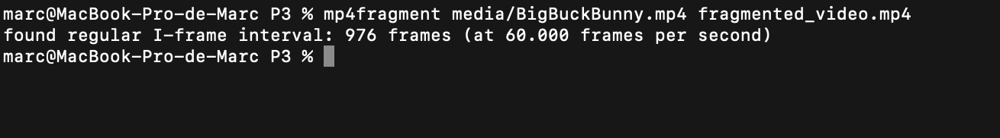
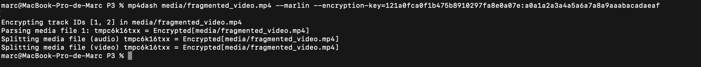
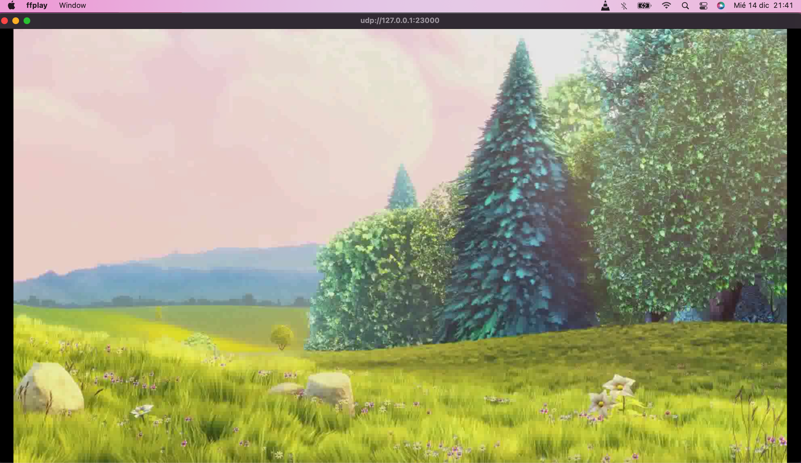
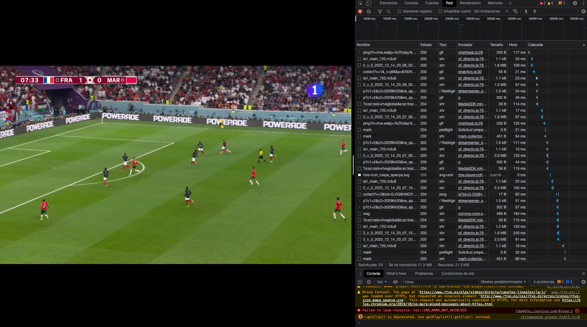
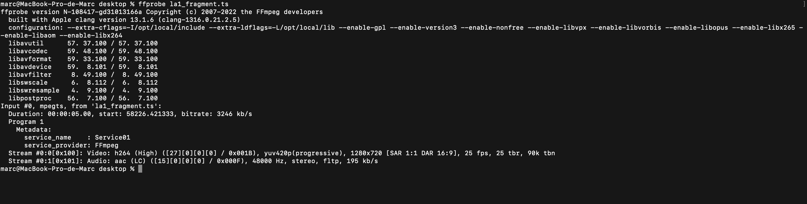

# SCAV-P3-Video

# Exercici 1 

Source: https://ottverse.com/hls-packaging-using-ffmpeg-live-vod/

Those steps were followed:
1 - We read the video from the disk 
2 - We scale the video to multiple resolutions required 
3 - Transcode each of the scaled videos to the required bitrates 
4 - Transcode the audio to the required bitrates 
5 - Combine the video and audio, package each combination, and create the individual TS segments and the playlists. 
6 - Create a master playlist that points to each of the variants

This script creates an HLS transport stream container with the BBB video. We obtain these files:

master.u3u8 --> Playlist with the streams in different resolutions
stream_0.u3u8 --> Video fragments in 1280x720 resolution
stream_1.u3u8 --> Video fragments in 854x480 resolution
stream_2.u3u8 --> Video fragments in 640x360 resolution

# Exercici 2 

This exercice was done by using the bento4 tools mp4fragment and mp4dash

Fragmentation:

Dash and encrytion: 

# Exercici 3

Source: https://trac.ffmpeg.org/wiki/StreamingGuide

# Exercici 4

rtve.es live was analyzed for this exercice:

